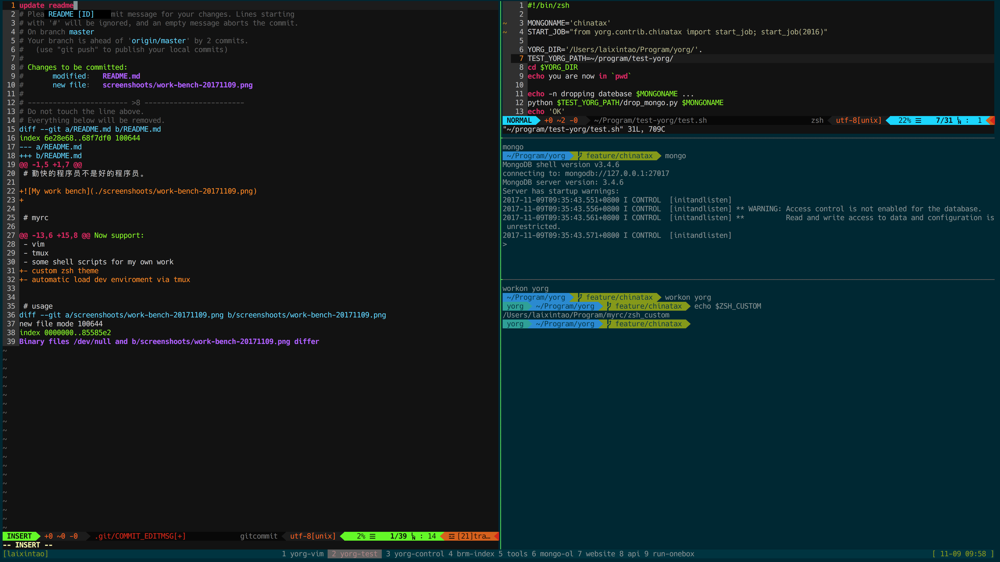

# 勤快的程序员不是好的程序员。

- Mac Gui app 使用 brew cask 管理；
- Mac 命令行程序使用 brew 管理；
- Python项目使用 virtualenvwrapper 管理；
- Python命令行工具使用 pipsi 管理；
- 虚拟机使用 vagrant 管理；

# myrc

My config files in Linux.

Now support:

- yarn
- bash
- zsh
- vim
- tmux
- some shell scripts for my own work
- custom zsh theme
- automatic load dev enviroment via tmux

# usage

0. molokai color scheme
1. run install [myrc path]
2. Some Installation please refer to .vimrc
    1. BundleInstall
    2. YouCompleteMe Install
3. Install dircolors and solarized for terminal manually:https://www.kawabangga.com/posts/1887

# todo list

- [x] shell script to delete the original rc files, and make softlinks to replace it .
- [x] reorgainze the files
- [x] wttr.in auto run when first time to open shell (by tmux)

1. install `xcode-select --install`
2. install `brew`
3. install zsh
4. install oh-my-zsh
5. install pip
